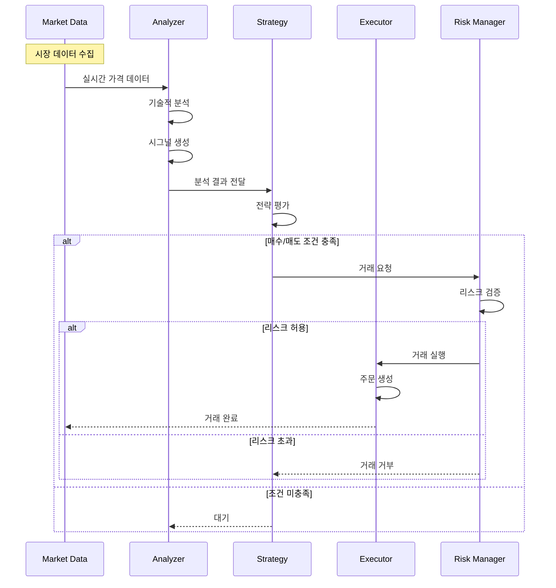
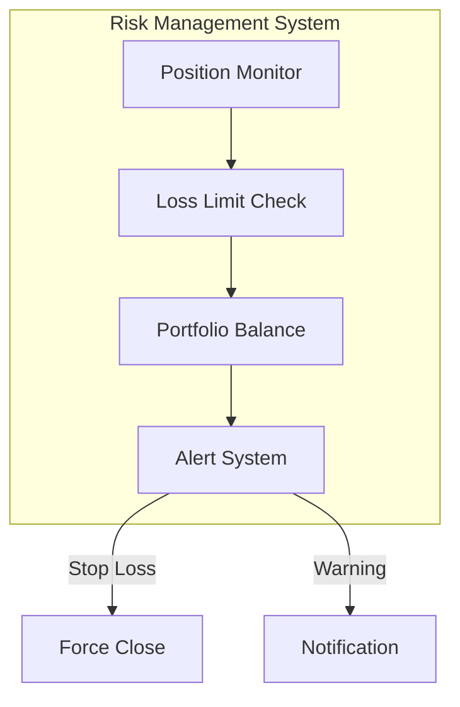
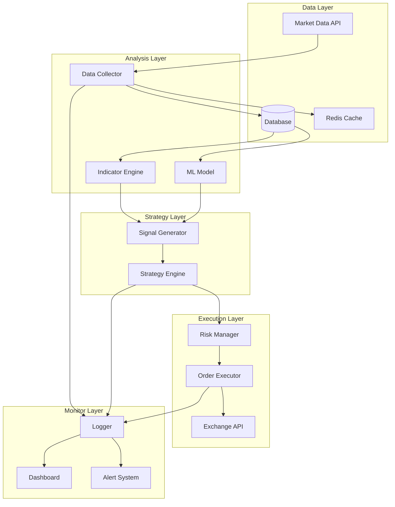

# Auto Trading System

자동 거래 시스템 - AI 기반 암호화폐/주식 자동 매매 플랫폼

## 📋 목차
- [시스템 FLOW](#-시스템-flow)
- [주요 작업 내용](#-주요-작업-내용)
- [주요 기능](#-주요-기능)
- [기술 스택](#-기술-스택)
- [설치 및 실행](#-설치-및-실행)

## 🔄 시스템 FLOW

### 전체 거래 흐름



### 1. 데이터 수집 및 분석 흐름

**단계별 상세 설명:**

1. **Market Data (시장 데이터 수집)**
   - 실시간 가격, 거래량, 호가 데이터 수집
   - 다중 거래소 데이터 통합
   - 데이터 정규화 및 저장

2. **Analyzer (분석 엔진)**
   - 기술적 지표 계산 (이동평균, RSI, MACD 등)
   - 패턴 인식 및 시그널 생성
   - AI 모델을 통한 예측

3. **Strategy (전략 엔진)**
   - 사전 정의된 거래 전략 평가
   - 매수/매도 조건 검증
   - 포지션 크기 결정

4. **Risk Manager (리스크 관리)**
   - 손실 한도 검증
   - 포트폴리오 밸런스 확인
   - 레버리지 제한 검사

5. **Executor (실행 엔진)**
   - 거래소 API를 통한 주문 실행
   - 체결 확인 및 상태 관리
   - 실행 결과 로깅

### 2. 리스크 관리 흐름



**리스크 관리 정책:**
- **손실 한도**: 일일/주간/월간 손실 제한
- **포지션 크기**: 총 자산 대비 최대 포지션 비율 제한
- **레버리지 관리**: 최대 레버리지 배수 제한
- **긴급 정지**: 비정상 시장 상황 시 자동 거래 중단

## 🛠 주요 작업 내용

### 1. Market Data Collector (데이터 수집기)

**담당 작업:**
- 실시간 시장 데이터 수집
- 다중 거래소 연동 (Binance, Upbit, Coinbase 등)
- 데이터 정규화 및 저장
- WebSocket 연결 관리

**주요 구현 내용:**
- 거래소 API 통합
- 실시간 데이터 스트리밍
- 데이터 캐싱 및 저장소 관리
- 연결 안정성 및 재연결 로직

### 2. Analysis Engine (분석 엔진)

**담당 작업:**
- 기술적 지표 계산
- 차트 패턴 인식
- AI/ML 모델 기반 예측
- 매매 시그널 생성

**주요 구현 내용:**
- 기술적 분석 알고리즘 (MA, RSI, MACD, Bollinger Bands)
- 머신러닝 모델 통합
- 실시간 시그널 생성
- 백테스팅 시스템

### 3. Strategy Engine (전략 엔진)

**담당 작업:**
- 거래 전략 관리
- 조건부 주문 생성
- 포지션 관리
- 전략 성과 추적

**주요 구현 내용:**
- 다양한 거래 전략 구현 (추세 추종, 평균 회귀, 차익거래 등)
- 조건부 로직 엔진
- 포지션 사이징 알고리즘
- 전략 백테스팅 및 최적화

### 4. Risk Manager (리스크 관리자)

**담당 작업:**
- 손실 한도 모니터링
- 포트폴리오 리스크 평가
- 긴급 정지 트리거
- 알림 시스템

**주요 구현 내용:**
- 실시간 리스크 메트릭 계산
- Stop Loss / Take Profit 자동 설정
- 포지션 청산 로직
- 다층 알림 시스템 (SMS, Email, Telegram)

### 5. Trade Executor (거래 실행자)

**담당 작업:**
- 주문 생성 및 실행
- 체결 확인
- 주문 상태 관리
- 거래 내역 기록

**주요 구현 내용:**
- 거래소 주문 API 통합
- 주문 타입 지원 (시장가, 지정가, 스톱)
- 부분 체결 처리
- 거래 로그 및 감사 추적

### 6. Monitoring & Logging (모니터링 및 로깅)

**담당 작업:**
- 시스템 성능 모니터링
- 거래 내역 로깅
- 에러 추적
- 대시보드 제공

**주요 구현 내용:**
- 실시간 대시보드
- 구조화된 로깅 시스템
- 성과 메트릭 추적
- 알림 및 리포트 생성

## 🚀 주요 기능

### 거래 기능
- **자동 매매**: 사전 정의된 전략에 따른 자동 주문 실행
- **다중 전략**: 여러 거래 전략 동시 운용
- **스마트 주문**: 조건부 주문, TWAP, VWAP 지원
- **포트폴리오 관리**: 다중 자산 포트폴리오 자동 리밸런싱

### 분석 기능
- **기술적 분석**: 20+ 기술적 지표 제공
- **AI 예측**: 머신러닝 기반 가격 예측
- **패턴 인식**: 차트 패턴 자동 인식
- **백테스팅**: 과거 데이터 기반 전략 검증

### 리스크 관리
- **손실 제한**: 일일/주간/월간 손실 한도 설정
- **자동 청산**: Stop Loss 자동 실행
- **포지션 관리**: 최대 포지션 크기 제한
- **긴급 정지**: 비정상 상황 자동 감지 및 중단

### 모니터링
- **실시간 대시보드**: 거래 현황 실시간 확인
- **성과 분석**: 수익률, 승률, 샤프 비율 등 메트릭 제공
- **알림 시스템**: 중요 이벤트 즉시 알림
- **감사 로그**: 모든 거래 내역 추적 가능

## 🏗 시스템 아키텍처



## 💻 기술 스택

### Backend
- **Runtime**: Node.js 20+
- **Language**: TypeScript
- **Framework**: Express.js
- **Database**: PostgreSQL, Redis
- **Message Queue**: RabbitMQ

### Analysis
- **Technical Analysis**: TA-Lib, Tulind
- **Machine Learning**: TensorFlow.js, Brain.js
- **Data Processing**: Pandas.js

### Infrastructure
- **Container**: Docker, Docker Compose
- **Monitoring**: Prometheus, Grafana
- **Logging**: Winston, ELK Stack

## 📋 시스템 요구사항

- Node.js 20+
- PostgreSQL 14+
- Redis 7+
- Docker & Docker Compose (선택사항)
- 거래소 API 키 (Binance, Upbit 등)

## 🛠 설치 및 실행

### 1. 저장소 클론

```bash
git clone https://github.com/smk692/auto-trading-system.git
cd auto-trading-system
```

### 2. 의존성 설치

```bash
# npm 사용
npm install

# yarn 사용
yarn install
```

### 3. 환경 변수 설정

`.env.example` 파일을 복사하여 `.env` 파일을 생성하고 설정합니다:

```bash
cp .env.example .env
```

#### 필수 환경 변수

```bash
# Database
DB_HOST=localhost
DB_PORT=5432
DB_NAME=trading_db
DB_USER=your_db_user
DB_PASSWORD=your_db_password

# Redis
REDIS_HOST=localhost
REDIS_PORT=6379

# Exchange API (예: Binance)
BINANCE_API_KEY=your_api_key
BINANCE_API_SECRET=your_api_secret

# Upbit API
UPBIT_ACCESS_KEY=your_access_key
UPBIT_SECRET_KEY=your_secret_key

# Risk Management
MAX_DAILY_LOSS=1000
MAX_POSITION_SIZE=10000
```

### 4. 데이터베이스 마이그레이션

```bash
npm run migrate
```

### 5. 실행

#### 개발 모드
```bash
npm run dev
```

#### 프로덕션 모드
```bash
npm run build
npm start
```

#### Docker로 실행
```bash
docker-compose up -d
```

## 📊 모니터링

- **Dashboard**: http://localhost:3000/dashboard
- **Grafana**: http://localhost:3001
- **API Docs**: http://localhost:3000/api-docs

## ⚠️ 주의사항

1. **투자 리스크**: 자동 거래 시스템은 투자 손실 위험이 있습니다.
2. **테스트 필수**: 실제 자금 투입 전 충분한 백테스팅과 페이퍼 트레이딩을 진행하세요.
3. **API 키 보안**: API 키는 절대 공개 저장소에 커밋하지 마세요.
4. **리스크 관리**: 손실 한도를 반드시 설정하고 지키세요.
5. **법적 책임**: 모든 거래 결과에 대한 책임은 사용자에게 있습니다.

## 📚 추가 문서

- [설치 가이드](docs/installation.md)
- [API 문서](docs/api.md)
- [전략 개발 가이드](docs/strategy-development.md)
- [백테스팅 가이드](docs/backtesting.md)

## 📝 라이선스

MIT License

## 🤝 기여

프로젝트에 기여하고 싶으시다면 Pull Request를 보내주세요!

1. Fork the Project
2. Create your Feature Branch (`git checkout -b feature/AmazingFeature`)
3. Commit your Changes (`git commit -m 'feat: Add some AmazingFeature'`)
4. Push to the Branch (`git push origin feature/AmazingFeature`)
5. Open a Pull Request

## ⚖️ 면책 조항

이 소프트웨어는 교육 및 연구 목적으로 제공됩니다. 실제 거래에 사용할 경우 발생하는 모든 손실에 대해 개발자는 책임을 지지 않습니다. 투자는 본인의 판단과 책임 하에 진행하시기 바랍니다.
