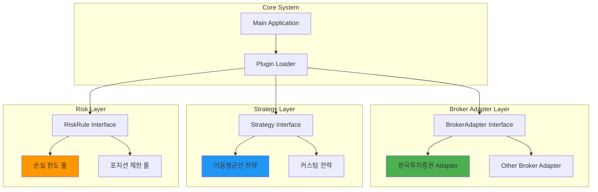
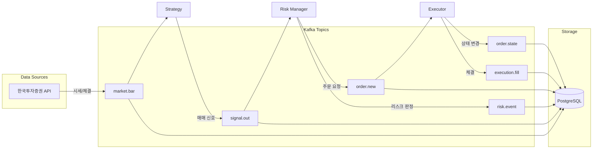
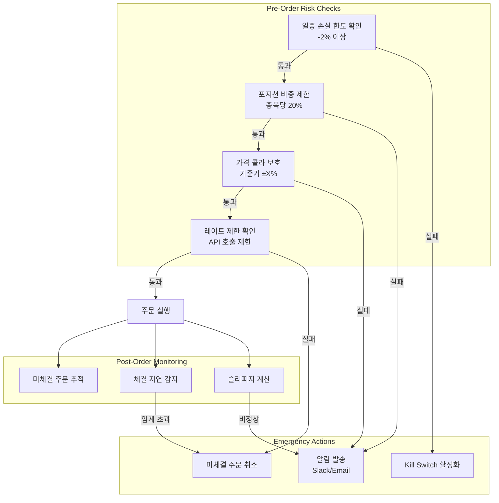
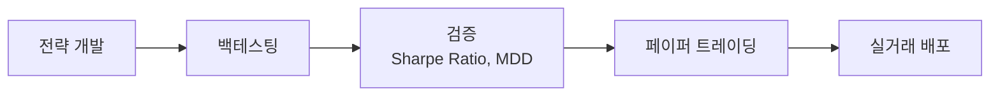
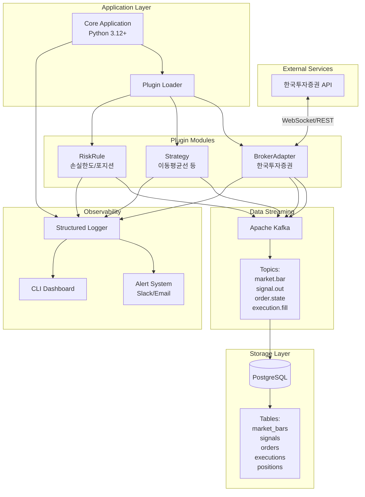

# Auto Trading System

개인용 주식 자동 매매 시스템 - 한국투자증권 OpenAPI 기반 퀀트 트레이딩 플랫폼

> **핵심 목표**: 데이터 기반 의사결정 자동화 및 모듈형 확장 가능한 구조 설계
> **기반 API**: 한국투자증권 OpenAPI (REST + WebSocket)
> **설계 원칙**: 브로커 추상화 계층을 통한 확장 가능한 아키텍처

## 📋 목차
- [시스템 FLOW](#-시스템-flow)
- [주요 작업 내용](#-주요-작업-내용)
- [핵심 기능](#-핵심-기능)
- [기술 스택](#-기술-스택)
- [설치 및 실행](#-설치-및-실행)

## 🔄 시스템 FLOW

### 1. 전체 거래 실행 흐름

```mermaid
sequenceDiagram
    participant API as 한국투자증권 API
    participant DC as Data Collector
    participant DB as PostgreSQL
    participant KF as Kafka
    participant ST as Strategy Plugin
    participant RM as Risk Manager
    partial EX as Order Executor

    Note over API: 시장 데이터 수집
    API->>DC: 실시간 시세/체결 데이터
    DC->>DB: 데이터 정규화 및 저장
    DC->>KF: market.bar 이벤트 발행

    KF->>ST: 시세 데이터 스트림
    ST->>ST: 전략 로직 실행<br/>(이동평균선, 거래량 필터)
    ST->>KF: signal.out 이벤트 발행<br/>(매수/매도 신호)

    KF->>RM: 시그널 수신
    RM->>RM: 리스크 룰 검증<br/>- 손실 한도<br/>- 포지션 제한<br/>- 쿨다운

    alt 리스크 허용
        RM->>EX: 주문 실행 요청
        EX->>API: send_order<br/>(client_order_id 포함)
        API-->>EX: 주문 접수 확인
        EX->>KF: order.state 이벤트
        EX->>DB: 주문 상태 저장

        API-->>EX: 체결 확인
        EX->>KF: execution.fill 이벤트
        EX->>DB: 포지션 업데이트
    else 리스크 초과
        RM->>KF: risk.event 발행
        RM-->>ST: 주문 거부
    end
```

### 2. 플러그인 아키텍처 흐름



### 3. 데이터 & 이벤트 스트림 흐름



### 4. 리스크 관리 상세 흐름



## 🛠 주요 작업 내용

### 1️⃣ 브로커 API 추상화 계층 (Broker Adapter Layer)

**목적**: 한국투자증권 API를 시작으로 다른 브로커로 확장 가능한 인터페이스 설계

**핵심 인터페이스**:
```python
class BrokerAdapter(Protocol):
    def get_price(self, symbol: str) -> Price
    def send_order(self, symbol: str, side: Side, qty: int,
                   price: Optional[Decimal], order_type: OrderType) -> OrderResult
    def get_balance(self) -> Balance
    def get_positions(self) -> List[Position]
    def get_order_status(self, order_id: str) -> OrderStatus
```

**구현 작업**:
- ✅ `KoreaInvestmentAdapter` - 한국투자증권 OpenAPI 연동
  - OAuth 토큰 관리 (자동 갱신)
  - 실시간 시세 WebSocket 연결
  - 주문/체결/잔고 API 통합
  - 에러 코드별 재시도 로직
- 🔄 향후 확장: 다른 브로커 Adapter 플러그인 추가 가능

**기술적 고려사항**:
- Rate Limiting: API 호출 제한 관리 (분당 제한 준수)
- Idempotency: `client_order_id`를 통한 중복 주문 방지
- Circuit Breaker: API 장애 시 자동 차단 및 복구

---

### 2️⃣ 데이터 수집 및 저장 (Data Collection & Storage)

**목적**: 실시간 시세 및 체결 데이터 수집, 정규화, 영구 저장

**담당 컴포넌트**:
- **Data Collector**: 한국투자증권 API 통한 실시간 시세 수집
- **Data Normalizer**: 다양한 소스의 데이터를 통일된 형식으로 변환
- **Storage Manager**: PostgreSQL + Kafka를 통한 데이터 저장 및 스트리밍

**핵심 작업**:
1. **실시간 시세 수집**
   - WebSocket 기반 실시간 호가/체결 데이터 수신
   - 분봉/일봉 데이터 생성 및 저장
   - 관심 종목 리스트 관리 (동적 추가/제거)

2. **데이터 정규화**
   ```python
   @dataclass
   class MarketBar:
       timestamp: datetime
       symbol: str
       open: Decimal
       high: Decimal
       low: Decimal
       close: Decimal
       volume: int
       source: str  # 'korea_investment'
   ```

3. **스토리지 아키텍처**
   - **PostgreSQL**: 과거 데이터 및 메타데이터 저장
     - `market_bars`: 시세 데이터 (파티셔닝: 날짜별)
     - `symbols`: 종목 정보
     - `orders`, `executions`, `positions`: 거래 이력
   - **Kafka Topics**:
     - `market.bar`: 실시간 시세 스트림
     - `signal.out`: 전략 신호
     - `order.state`, `execution.fill`: 주문/체결 이벤트

**데이터 품질 보장**:
- 결측치 감지 및 보간 로직
- 중복 데이터 필터링
- 타임스탬프 정규화 (UTC 기준)

---

### 3️⃣ 전략 플러그인 시스템 (Strategy Plugin System)

**목적**: 전략 로직을 외부 모듈로 분리하여 유연한 확장 및 교체 가능

**플러그인 인터페이스**:
```python
class Strategy(Protocol):
    def on_bar(self, bar: MarketBar) -> Optional[Signal]
    def on_signal(self, signal: Signal) -> Optional[Order]
    def get_config(self) -> StrategyConfig
```

**기본 제공 전략**:

1. **이동평균선 전략 (Moving Average Strategy)**
   ```yaml
   strategy:
     name: ma_crossover
     params:
       short_period: 50
       long_period: 200
       volume_filter: true
       min_volume: 100000
   ```
   - 로직:
     - 단기 이평선(50일) > 장기 이평선(200일) → 매수 신호
     - 단기 이평선(50일) < 장기 이평선(200일) → 매도 신호
     - 거래량 필터: 평균 거래량 대비 N배 이상

2. **손절/익절 전략**
   ```yaml
   risk_params:
     stop_loss: -5%
     take_profit: +10%
     trailing_stop: true
   ```

**전략 개발 워크플로우**:


**플러그인 로딩 및 격리**:
- Entry Point 기반 플러그인 발견
- 화이트리스트 기반 모듈 로딩
- 타임아웃 및 샌드박스 격리 (보안)

---

### 4️⃣ 리스크 관리 시스템 (Risk Management)

**목적**: 손실 제한 및 포지션 관리를 통한 자본 보호

**리스크 룰 구현**:

1. **손실 한도 (Loss Limit)**
   - 일중 손실 -2% 초과 시 → 거래 중지
   - 주간/월간 손실 누적 모니터링
   - 실현/미실현 손익 합산 계산

2. **포지션 제한 (Position Sizing)**
   - 종목당 최대 보유 비중: 총 자산의 20%
   - 최대 동시 보유 종목 수: 5개
   - 종목당 최대 주문 수량 제한

3. **가격 콜라 보호 (Price Collar)**
   - 기준가 대비 ±5% 벗어난 주문 차단
   - 급격한 가격 변동 시 주문 보류 (Circuit Breaker)

4. **레이트 제한 및 쿨다운 (Rate Limiting & Cooldown)**
   - API 호출 제한 준수 (분당/초당 제한)
   - 동일 종목 연속 주문 실패 시 30분 쿨다운

**리스크 이벤트 로깅**:
```python
@dataclass
class RiskEvent:
    rule_id: str
    symbol: str
    judgment: bool  # True = 허용, False = 거부
    reason: str
    snapshot: Dict  # 판정 시점 데이터
    timestamp: datetime
```

**Kill Switch (긴급 정지)**:
- 전역 Kill Switch: 모든 전략 즉시 중단
- 전략별 Kill Switch: 특정 전략만 중단
- 미체결 주문 자동 취소 옵션

---

### 5️⃣ 주문 실행 엔진 (Order Executor)

**목적**: 한국투자증권 API를 통한 안전한 주문 실행 및 체결 관리

**주문 생성 및 실행**:
```python
@dataclass
class Order:
    client_order_id: str  # UUID (멱등성 보장)
    symbol: str
    side: Side  # BUY | SELL
    quantity: int
    price: Optional[Decimal]  # None for market orders
    order_type: OrderType  # MARKET | LIMIT | STOP
    status: OrderStatus  # NEW | SUBMITTED | FILLED | CANCELLED
    created_at: datetime
    updated_at: datetime
```

**주문 상태 추적**:
1. `NEW` → `SUBMITTED` → `FILLED` (정상 체결)
2. `NEW` → `SUBMITTED` → `CANCELLED` (취소)
3. `NEW` → `SUBMITTED` → `PARTIAL_FILLED` → `FILLED` (부분 체결)

**체결 확인 로직**:
- 실시간 체결 피드 수신 (WebSocket)
- Polling 백업 (체결 확인 실패 시)
- 체결 타임아웃: 5분 이내 미체결 시 알림

**에러 처리 및 재시도**:
```python
retry_policy = {
    'network_error': {'max_retries': 3, 'backoff': 'exponential'},
    'rate_limit': {'max_retries': 1, 'backoff': 'fixed', 'delay': 60},
    'insufficient_balance': {'max_retries': 0, 'alert': True},
}
```

---

### 6️⃣ 관측성 및 모니터링 (Observability)

**목적**: 시스템 동작 추적, 성과 분석, 장애 대응

**구조화 로깅**:
```json
{
  "timestamp": "2025-10-03T10:30:00Z",
  "level": "INFO",
  "correlation_id": "abc-123",
  "event": "order_submitted",
  "symbol": "005930",
  "client_order_id": "uuid-...",
  "reason": "ma_crossover_buy_signal",
  "metadata": {"strategy": "ma_strategy", "risk_check": "passed"}
}
```

**핵심 메트릭**:
| 메트릭 | 설명 | 임계값 |
|--------|------|--------|
| `order_latency` | 주문 실행 지연 시간 | < 500ms |
| `fill_rate` | 체결 성공률 | > 95% |
| `slippage` | 예상가 대비 체결가 차이 | < 0.5% |
| `daily_pnl` | 일일 손익 | > -2% |
| `max_drawdown` | 최대 낙폭 | < 10% |

**알림 시스템**:
- **Slack**: 실시간 거래 알림, 에러 알림
- **Email**: 일일/주간 리포트, 중요 이벤트
- 알림 레벨: `INFO` | `WARNING` | `CRITICAL`

**대시보드 (최소 CLI)**:
```
=== Auto Trading System ===
Status: RUNNING
Active Strategies: ma_strategy (1)
Positions: 005930 (100 shares, +2.5%)
Daily PnL: +₩50,000 (+1.2%)
Max Drawdown: -3.8%
```

## 🚀 핵심 기능

### 1. 브로커 API 추상화
- ✅ **한국투자증권 OpenAPI 연동**: 실시간 시세, 주문, 체결, 잔고 조회
- 🔄 **확장 가능한 인터페이스**: 다른 브로커로 교체 가능한 플러그인 구조
- 🔐 **인증 관리**: OAuth 토큰 자동 갱신 및 안전한 키 관리
- ⚡ **Rate Limiting**: API 호출 제한 준수 및 지수 백오프 재시도

### 2. 전략 실행
- 📊 **이동평균선 전략**: 50일/200일 교차 기반 매매 신호
- 📈 **거래량 필터**: 평균 거래량 대비 N배 이상 조건 검증
- 🎯 **손절/익절**: 자동 Stop Loss (-5%) / Take Profit (+10%)
- 🔌 **플러그인 시스템**: 커스텀 전략 외부 모듈로 추가 가능

### 3. 리스크 관리
- 🛡️ **손실 한도**: 일일 -2% 초과 시 자동 거래 중지
- 📊 **포지션 제한**: 종목당 20% 비중, 최대 5개 종목 동시 보유
- 🚨 **Kill Switch**: 전역/전략별 즉시 중단 기능
- ⏱️ **쿨다운**: 연속 실패 시 30분 대기

### 4. 데이터 관리
- 💾 **PostgreSQL**: 시세, 주문, 체결 이력 영구 저장
- 🔄 **Kafka 스트리밍**: 실시간 이벤트 스트림 처리
- 📡 **WebSocket**: 실시간 시세 및 체결 데이터 수신
- 🔍 **데이터 품질**: 결측치 감지, 중복 필터링, 정규화

### 5. 관측성
- 📝 **구조화 로깅**: JSON 형식 로그 + correlation_id 추적
- 📊 **핵심 메트릭**: 주문 지연, 체결률, 슬리피지, 일일 손익
- 🔔 **알림**: Slack/Email을 통한 실시간 이벤트 알림
- 📈 **대시보드**: CLI 기반 실시간 현황 모니터링

## 🏗 시스템 아키텍처



## 💻 기술 스택

### Runtime & Language
- **Language**: Python 3.12+ (LTS)
- **패키지 관리**: uv 또는 poetry (잠금파일 필수)
- **타입 체킹**: mypy 또는 pyright
- **코드 품질**: ruff, black, bandit (보안 정적분석)
- **동시성**: asyncio 기반 이벤트 루프

### Database & Streaming
- **RDBMS**: PostgreSQL 14+ (시계열 데이터, 주문/체결/포지션)
  - 연결 풀: asyncpg 또는 psycopg 3
  - 파티셔닝: 날짜별, 인덱스: (timestamp, symbol)
- **Message Streaming**: Apache Kafka
  - 토픽: market.bar, signal.out, order.state, execution.fill, risk.event
  - 키 파티셔닝: symbol 기준 순서 보장
  - 스키마: Avro 또는 Protobuf (스키마 레지스트리 권장)

### Broker Integration
- **한국투자증권 OpenAPI**
  - 인증: OAuth 2.0 (자동 토큰 갱신)
  - 실시간 시세: WebSocket
  - 주문/체결: REST API
  - Rate Limiting: 분당/초당 제한 준수

### Infrastructure
- **Container**: Docker (슬림 베이스 + distroless 런타임)
- **구성 관리**: pydantic-settings (YAML/ENV)
- **관측성**:
  - 로깅: 구조화 JSON 로그 (correlation_id)
  - 메트릭: 주문 지연, 체결률, 슬리피지, PnL
  - 알림: Slack, Email

### Security
- **비밀 관리**: 환경변수 또는 외부 secrets manager
- **통신 보안**: TLS 강제 (브로커/DB)
- **시간 동기화**: NTP, UTC 타임스탬프

## 📋 시스템 요구사항

### 필수 요구사항
- **Python**: 3.12+ (LTS 권장)
- **PostgreSQL**: 14+
- **Apache Kafka**: 2.8+ (또는 Confluent Platform)
- **Docker & Docker Compose**: 최신 버전 (선택사항)
- **한국투자증권 API 키**: 모의투자 또는 실거래 계정

### 인프라 요구사항
- **OS**: Linux (Ubuntu 22.04 LTS) 또는 macOS
- **메모리**: 최소 4GB (권장 8GB+)
- **디스크**: 최소 20GB (데이터 저장 공간)
- **네트워크**: 안정적인 인터넷 연결 (실시간 시세 수신)

---

## 🛠 설치 및 실행

### 1. 저장소 클론

```bash
git clone https://github.com/smk692/auto-trading-system.git
cd auto-trading-system
```

### 2. Python 환경 설정

#### uv 사용 (권장)
```bash
# uv 설치
curl -LsSf https://astral.sh/uv/install.sh | sh

# 가상환경 생성 및 의존성 설치
uv venv
source .venv/bin/activate  # Windows: .venv\Scripts\activate
uv pip install -r requirements.lock
```

#### poetry 사용
```bash
# poetry 설치
curl -sSL https://install.python-poetry.org | python3 -

# 의존성 설치
poetry install
poetry shell
```

### 3. 인프라 설정 (Docker Compose)

#### PostgreSQL + Kafka 실행
```bash
# docker-compose.yml 파일로 인프라 시작
docker-compose up -d postgres kafka

# 데이터베이스 초기화
python scripts/init_db.py
```

#### 수동 설정 (선택사항)
```bash
# PostgreSQL 설치 및 데이터베이스 생성
createdb trading_db

# Kafka 설치 및 토픽 생성
kafka-topics.sh --create --topic market.bar --bootstrap-server localhost:9092
kafka-topics.sh --create --topic signal.out --bootstrap-server localhost:9092
kafka-topics.sh --create --topic order.state --bootstrap-server localhost:9092
kafka-topics.sh --create --topic execution.fill --bootstrap-server localhost:9092
kafka-topics.sh --create --topic risk.event --bootstrap-server localhost:9092
```

### 4. 환경 변수 설정

`.env.example` 파일을 복사하여 `.env` 파일을 생성:

```bash
cp .env.example .env
```

#### 필수 환경 변수 (`.env`)

```bash
# === Database ===
DB_HOST=localhost
DB_PORT=5432
DB_NAME=trading_db
DB_USER=trader
DB_PASSWORD=your_secure_password

# === Kafka ===
KAFKA_BOOTSTRAP_SERVERS=localhost:9092
KAFKA_SCHEMA_REGISTRY_URL=http://localhost:8081  # 선택사항

# === 한국투자증권 API ===
KI_APP_KEY=your_app_key
KI_APP_SECRET=your_app_secret
KI_ACCOUNT_NUMBER=12345678-01
KI_ACCOUNT_TYPE=PAPER  # PAPER | REAL

# === Risk Management ===
MAX_DAILY_LOSS_PCT=2.0
MAX_POSITION_PCT=20.0
MAX_CONCURRENT_POSITIONS=5
PRICE_COLLAR_PCT=5.0

# === Strategy ===
STRATEGY_NAME=ma_crossover
STRATEGY_SHORT_PERIOD=50
STRATEGY_LONG_PERIOD=200
STRATEGY_VOLUME_FILTER=true

# === Alerting ===
SLACK_WEBHOOK_URL=https://hooks.slack.com/services/YOUR/WEBHOOK/URL
ALERT_EMAIL=your-email@example.com
```

### 5. 데이터베이스 마이그레이션

```bash
# 스키마 마이그레이션 실행
python -m alembic upgrade head

# 초기 데이터 로드 (관심 종목 등)
python scripts/seed_symbols.py
```

### 6. 실행

#### 개발 모드 (모의투자)
```bash
# 환경변수 확인
export KI_ACCOUNT_TYPE=PAPER

# 애플리케이션 실행
python -m trading_system.main
```

#### 프로덕션 모드 (실거래)
```bash
# 환경변수 확인
export KI_ACCOUNT_TYPE=REAL

# Docker 컨테이너로 실행 (권장)
docker-compose up -d trading-system
```

#### CLI 대시보드 실행
```bash
# 별도 터미널에서 대시보드 실행
python -m trading_system.dashboard
```

---

## 📊 모니터링 및 관리

### 로그 확인
```bash
# 실시간 로그 스트림
tail -f logs/trading_system.log

# JSON 로그 쿼리 (jq 사용)
cat logs/trading_system.log | jq '.event == "order_submitted"'
```

### 메트릭 확인
```bash
# CLI 대시보드
python -m trading_system.dashboard

# PostgreSQL에서 직접 쿼리
psql trading_db -c "SELECT * FROM metrics WHERE date = CURRENT_DATE;"
```

### Kill Switch 활성화
```bash
# 전역 Kill Switch (모든 전략 중단)
python -m trading_system.cli kill-switch --global

# 특정 전략만 중단
python -m trading_system.cli kill-switch --strategy ma_crossover
```

---

## ⚠️ 주의사항 및 리스크 안내

### 🚨 중요: 반드시 읽어주세요

1. **투자 손실 위험**
   - 자동 거래 시스템은 **원금 손실 가능성**이 있습니다.
   - 과거 성과는 미래 수익을 보장하지 않습니다.
   - **손실 감수 가능한 자금**으로만 운영하세요.

2. **테스트 필수 프로세스**
   ```
   백테스팅 (과거 데이터)
   → 페이퍼 트레이딩 (모의투자, 최소 1개월)
   → 소액 실거래 (최소 금액으로 검증)
   → 점진적 자금 증액
   ```
   - **실거래 전 충분한 검증 기간** 확보 필수

3. **보안 및 키 관리**
   - ❌ **절대 금지**: API 키를 Git 저장소에 커밋
   - ✅ **필수**: `.env` 파일을 `.gitignore`에 추가
   - ✅ **권장**: 환경변수 또는 secrets manager 사용
   - 🔐 실거래 API 키는 **읽기 전용 권한** 최소화

4. **리스크 관리 설정**
   - **손실 한도**: 반드시 일일 -2% 이하로 설정
   - **포지션 제한**: 종목당 20% 이하 비중 유지
   - **Kill Switch**: 긴급 상황 대응 절차 숙지

5. **시스템 안정성**
   - 네트워크 장애, API 장애 시 자동 중단 설정
   - 정기적인 로그 및 메트릭 모니터링
   - 비정상 동작 감지 시 즉시 중단

6. **법적 책임**
   - 모든 거래 결과에 대한 **책임은 사용자 본인**에게 있습니다.
   - 본 소프트웨어는 **교육 및 연구 목적**으로 제공됩니다.
   - 금융 당국의 규제를 준수하여 운영하세요.

---

## 📚 추가 문서 및 리소스

### 프로젝트 문서
- [📖 PRD (Product Requirements Document)](PRD.md) - 전체 시스템 설계 및 요구사항
- [🔧 설치 가이드](docs/installation.md) - 상세 설치 및 환경 구성
- [📊 전략 개발 가이드](docs/strategy-development.md) - 커스텀 전략 플러그인 개발
- [🧪 백테스팅 가이드](docs/backtesting.md) - 전략 검증 및 최적화

### API 문서
- [🔌 한국투자증권 API 연동](docs/korea-investment-api.md) - API 사용법 및 제한사항
- [🏗️ 플러그인 API](docs/plugin-api.md) - BrokerAdapter, Strategy, RiskRule 인터페이스

### 운영 가이드
- [📈 모니터링 및 알림](docs/monitoring.md) - 로그, 메트릭, 알림 설정
- [🛡️ 리스크 관리](docs/risk-management.md) - 손실 제한 및 안전장치 운영
- [🚨 장애 대응](docs/troubleshooting.md) - 일반적인 문제 해결 방법

### 개발 로드맵
- **v0** (현재): 데이터 수집 + 신호 출력
- **v1**: 한국투자증권 API 주문 연동 + 체결 확인
- **v1.1**: 리스크 제어, 리포트, 알림 추가
- **v2**: 전략 플러그인 구조 + UI 대시보드 확장
- **v3**: 다중 브로커 Adapter 지원 + 고급 전략

## 📝 라이선스

MIT License

## 🤝 기여

프로젝트에 기여하고 싶으시다면 Pull Request를 보내주세요!

1. Fork the Project
2. Create your Feature Branch (`git checkout -b feature/AmazingFeature`)
3. Commit your Changes (`git commit -m 'feat: Add some AmazingFeature'`)
4. Push to the Branch (`git push origin feature/AmazingFeature`)
5. Open a Pull Request

## ⚖️ 면책 조항

이 소프트웨어는 교육 및 연구 목적으로 제공됩니다. 실제 거래에 사용할 경우 발생하는 모든 손실에 대해 개발자는 책임을 지지 않습니다. 투자는 본인의 판단과 책임 하에 진행하시기 바랍니다.
