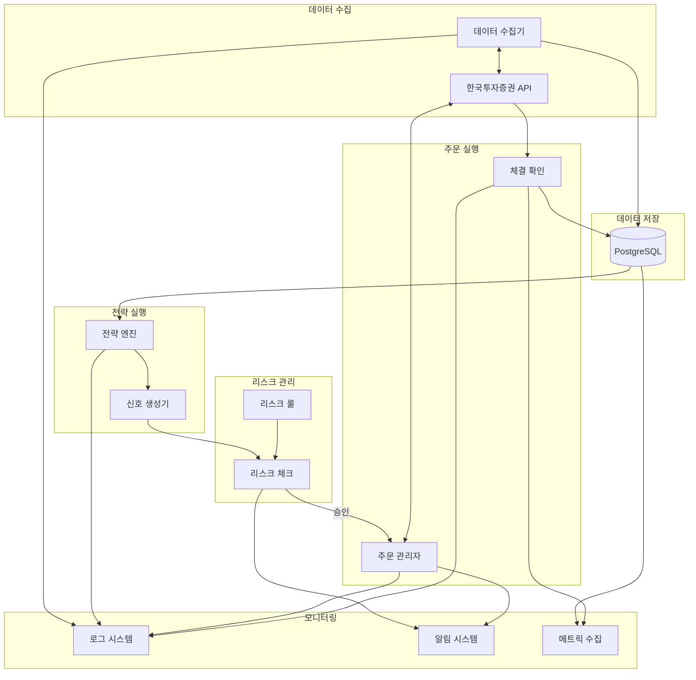
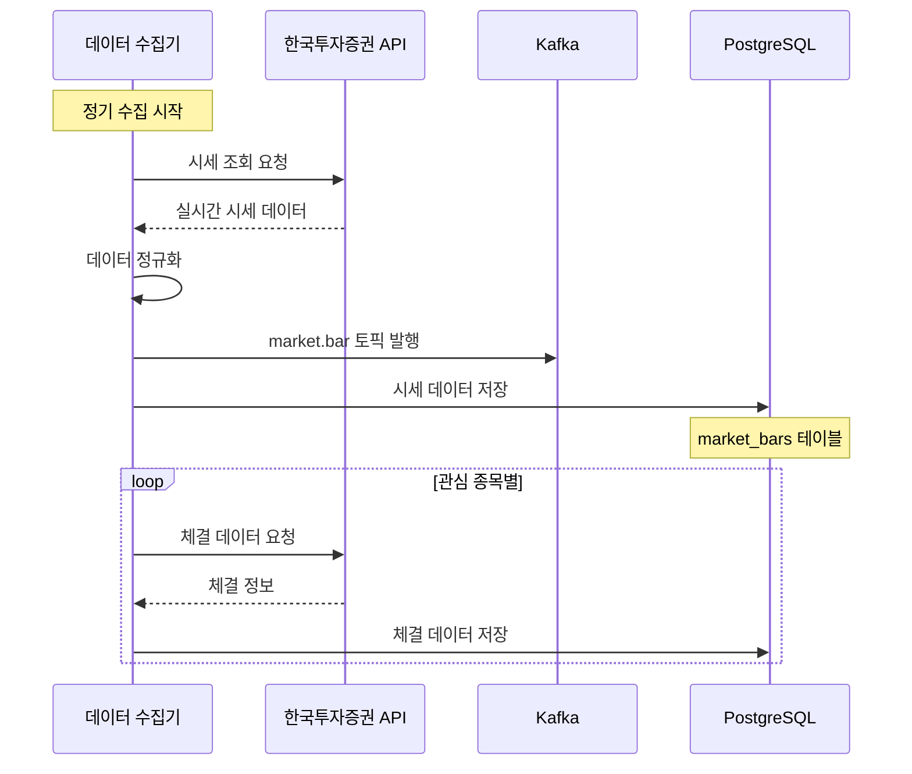
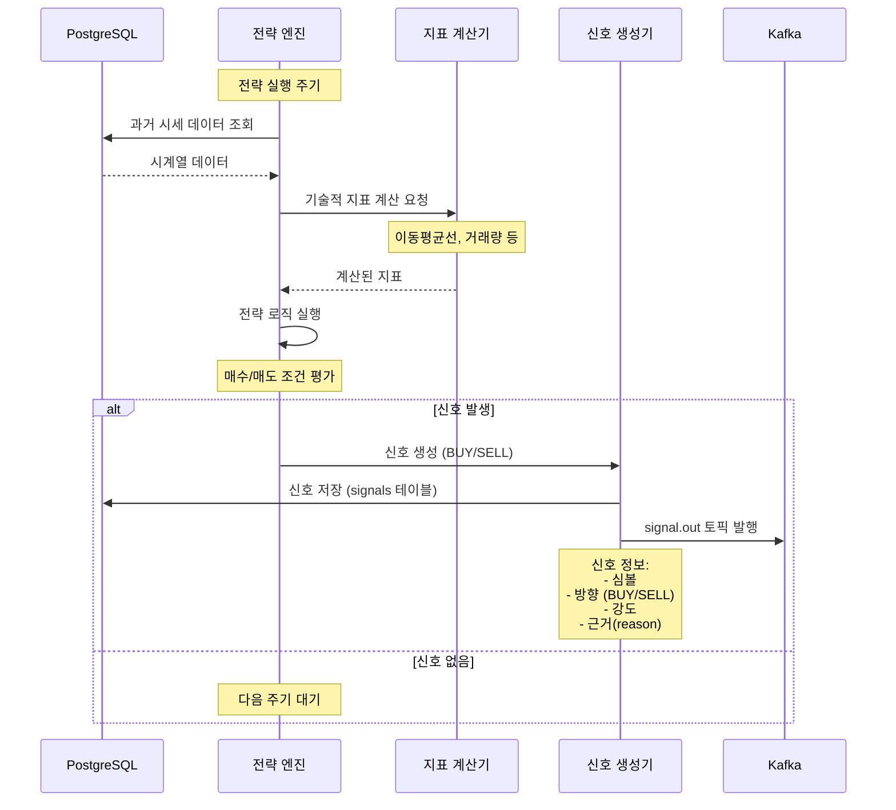
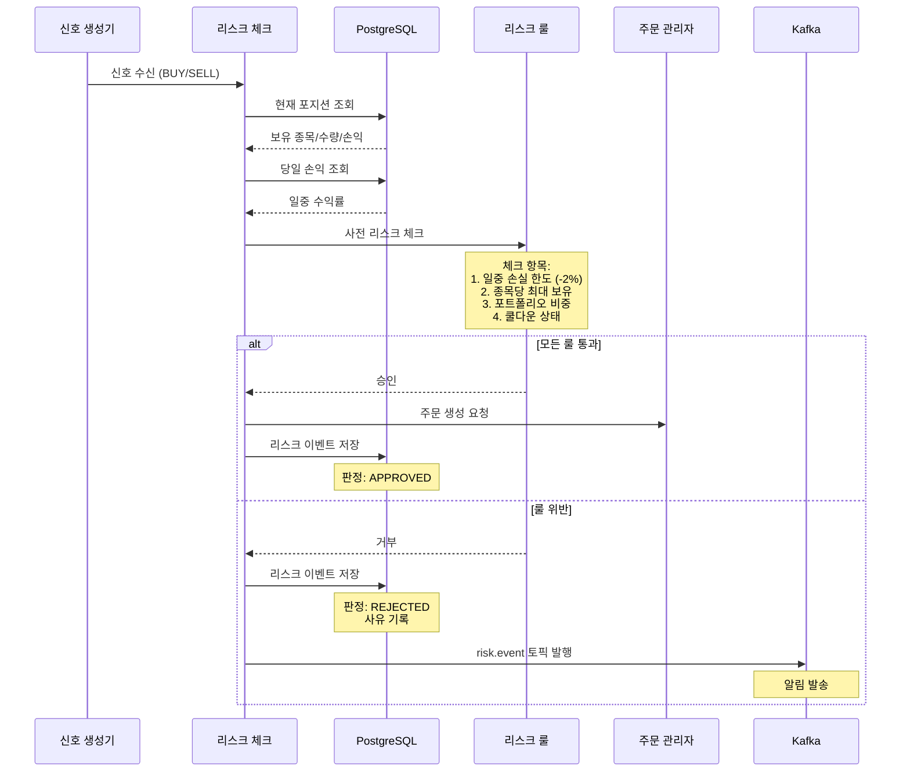
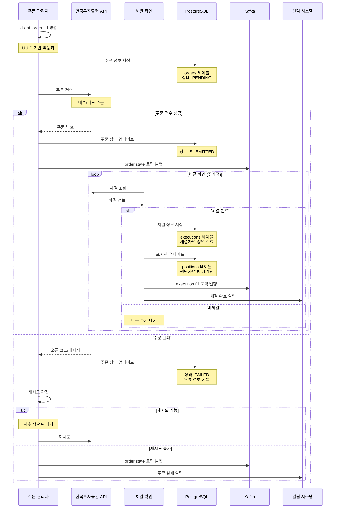
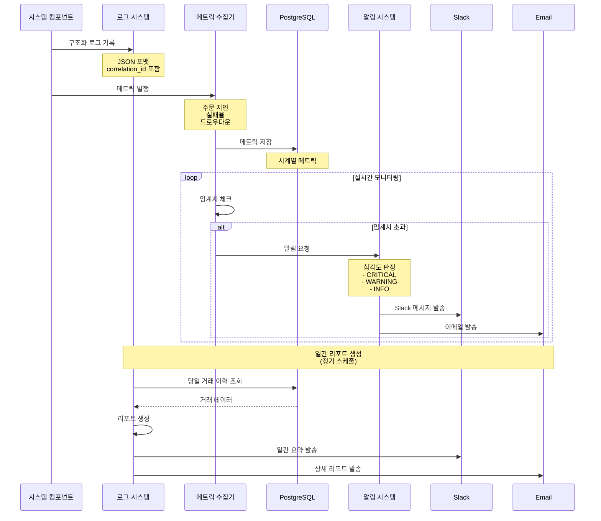

# 개인용 주식 자동 매매 시스템

[](LICENSE)
[](https://www.python.org/)

개인 투자자를 위한 데이터 기반 자동 매매 시스템입니다. 한국투자증권 API를 활용하여 퀀트 전략 기반의 자동 매매를 실행하고, 모듈형 구조로 다른 브로커 API로 확장 가능합니다.

## 📋 목차
- [시스템 FLOW](#-시스템-flow)
- [주요 작업 내용](#-주요-작업-내용)
- [주요 기능](#-주요-기능)
- [시스템 아키텍처](#-시스템-아키텍처)
- [기술 스택](#-기술-스택)

## 🔄 시스템 FLOW

### 전체 시스템 흐름



### 1. 데이터 수집 흐름



**단계별 상세 설명:**

1. **데이터 수집기 시작**
   - 설정된 주기(예: 1분)마다 실행
   - 관심 종목 리스트 로드

2. **한국투자증권 API 호출**
   - 인증 토큰 확인 및 갱신 (만료 시)
   - 시세 데이터 요청 (OHLCV + 거래량)
   - Rate Limit 준수

3. **데이터 정규화**
   - 시간대 UTC로 통일
   - 가격/거래량 형식 정규화
   - 소스(source) 메타데이터 추가

4. **Kafka 발행**
   - `market.bar` 토픽으로 실시간 스트리밍
   - 심볼(symbol) 키로 파티셔닝
   - At-least-once 전달 보장

5. **PostgreSQL 저장**
   - `market_bars` 테이블에 시계열 저장
   - 파티셔닝: 날짜/심볼 기준
   - 인덱스: timestamp, symbol

### 2. 전략 실행 및 신호 생성 흐름



**단계별 상세 설명:**

1. **과거 데이터 조회**
   - 전략에 필요한 기간만큼 시세 데이터 로드
   - 예: 이동평균선 200일 전략 → 200일치 데이터

2. **기술적 지표 계산**
   - 이동평균선 (MA50, MA200)
   - RSI, MACD 등 (전략에 따라)
   - 거래량 지표

3. **전략 로직 실행**
   - 매수 조건 체크
     - 예: MA50 > MA200 (골든크로스)
     - 거래량 > 평균 거래량 * 1.5
   - 매도 조건 체크
     - 예: MA50 < MA200 (데드크로스)
     - 손절선 도달 (-5%)
     - 목표가 도달 (+10%)

4. **신호 생성 및 저장**
   - 신호 객체 생성 (방향, 강도, 근거)
   - `signals` 테이블에 저장
   - 파라미터 해시 기록 (재현성)

5. **Kafka 발행**
   - `signal.out` 토픽으로 실시간 전달
   - 다운스트림 컴포넌트 (리스크, 주문) 알림

### 3. 리스크 관리 흐름



**단계별 상세 설명:**

1. **신호 수신**
   - `signal.out` 토픽에서 신호 수신
   - 신호 유효성 검증 (필수 필드 확인)

2. **현재 상태 조회**
   - 보유 포지션 확인
   - 당일 거래 이력
   - 현재 손익 계산

3. **리스크 룰 평가**
   - **일중 손실 한도**: 당일 손익 < -2% → 거부
   - **종목 보유 제한**: 동일 종목 과다 보유 → 거부
   - **포트폴리오 비중**: 단일 종목 > 20% → 거부
   - **쿨다운**: 최근 실패 이력 → 대기 필요

4. **승인 처리**
   - 모든 룰 통과 시 주문 관리자에게 전달
   - 리스크 이벤트 기록 (승인/거부 모두)

5. **거부 처리**
   - 사유와 함께 이벤트 저장
   - 알림 발송 (Slack/Email)
   - 신호는 무시하고 종료

### 4. 주문 실행 및 체결 확인 흐름



**단계별 상세 설명:**

1. **주문 생성**
   - `client_order_id` 생성 (UUID)
   - 멱등성 보장 (중복 주문 방지)
   - 주문 정보를 `orders` 테이블에 저장

2. **API 주문 전송**
   - 한국투자증권 API 호출
   - 매수/매도 구분
   - 수량, 가격, 주문 유형 전달

3. **주문 접수 처리**
   - 성공 시: 주문 번호 저장, 상태 SUBMITTED
   - 실패 시: 오류 코드 기록, 재시도 로직

4. **체결 확인 루프**
   - 주기적으로 체결 상태 조회
   - 부분 체결 처리 (누적 체결 수량)
   - 완전 체결 시 루프 종료

5. **체결 처리**
   - `executions` 테이블에 체결 정보 저장
   - 체결가, 수량, 수수료, 세금 기록
   - `positions` 테이블 업데이트 (평단가 재계산)

6. **실패 처리**
   - 재시도 가능 오류: 지수 백오프 후 재시도
   - 재시도 불가 오류: 알림 발송 및 종료
   - 모든 실패는 로그 및 DB에 기록

### 5. 모니터링 및 알림 흐름



**모니터링 항목:**

1. **로그 시스템**
   - 구조화 로그 (JSON 포맷)
   - Correlation ID로 주문 추적
   - 주문 타임라인 로그 (생성→제출→체결)

2. **메트릭 수집**
   - 주문 지연 (latency)
   - 주문 실패율
   - 슬리피지 (예상가 vs 체결가)
   - 현재 드로우다운
   - 최대 드로우다운
   - 체결 비율

3. **알림 시스템**
   - **CRITICAL**: Kill Switch 발동, API 장애, 일중 손실 한도 도달
   - **WARNING**: 주문 실패 누적, 체결 지연, 네트워크 불안정
   - **INFO**: 체결 완료, 포지션 변경, 일간 요약

4. **일간 리포트**
   - 수익률 (실현/미실현)
   - 거래 횟수 및 금액
   - 전략별 성과
   - 리스크 이벤트 요약

## 🛠 주요 작업 내용

### 1. 데이터 수집 모듈

**담당 작업:**
- 한국투자증권 API 연동
- 실시간 시세 수집 및 정규화
- 체결 데이터 수집
- Kafka 스트리밍 발행
- PostgreSQL 저장

**주요 구현 내용:**
- API 인증 및 토큰 관리 (자동 갱신)
- Rate Limit 준수 로직
- 데이터 정규화 파이프라인
- Kafka Producer 구현
- 시계열 데이터 파티셔닝

### 2. 전략 엔진

**담당 작업:**
- 기술적 지표 계산
- 매수/매도 신호 생성
- 전략 파라미터 관리
- 백테스팅 지원

**주요 구현 내용:**
- 플러그인 아키텍처 (전략 모듈 동적 로딩)
- 이동평균선 전략 구현
- RSI, MACD 등 지표 계산기
- 파라미터 외부화 (YAML/JSON)
- 신호 생성 및 검증

### 3. 리스크 관리 모듈

**담당 작업:**
- 사전/사후 리스크 체크
- 포지션 제한 관리
- 손실 한도 모니터링
- 쿨다운 관리

**주요 구현 내용:**
- 리스크 룰 엔진
- 일중 손실 한도 체크
- 종목/포트폴리오 비중 제한
- 주문 실패 쿨다운 로직
- 리스크 이벤트 기록

### 4. 주문 관리 시스템

**담당 작업:**
- 주문 생성 및 전송
- 체결 확인 및 추적
- 포지션 업데이트
- 주문 실패 처리

**주요 구현 내용:**
- Idempotent 주문 (client_order_id)
- 주문 상태 머신 (PENDING → SUBMITTED → FILLED/FAILED)
- 체결 확인 루프
- 평단가 재계산 로직
- 재시도 및 에러 핸들링

### 5. 모니터링 및 알림 시스템

**담당 작업:**
- 구조화 로그 기록
- 메트릭 수집 및 저장
- 임계치 모니터링
- 알림 발송 (Slack/Email)
- 일간 리포트 생성

**주요 구현 내용:**
- JSON 로깅 (correlation_id)
- 주문 타임라인 추적
- Prometheus 메트릭 (선택)
- Slack Webhook 연동
- 이메일 발송 시스템
- 일간 리포트 생성기

## 🚀 주요 기능

### 핵심 기능
- **자동 매매**: 퀀트 전략 기반 자동 주문 실행
- **데이터 수집**: 실시간 시세 및 체결 데이터 수집·저장
- **리스크 관리**: 손실 한도, 포지션 제한, 쿨다운 관리
- **모니터링**: 실시간 메트릭 및 알림, 일간 리포트

### 안전 장치
- **Kill Switch**: 전역/전략 단위 즉시 중단
- **가격 보호**: 기준가 대비 ±X% 외 주문 차단
- **레이트 제한**: API 호출 제한 준수
- **멱등성**: 중복 주문 방지 (client_order_id)

### 확장성
- **플러그인 아키텍처**: 전략/브로커 모듈 교체 가능
- **멀티 브로커**: BrokerAdapter 인터페이스로 추상화
- **스트리밍**: Kafka 기반 이벤트 처리
- **파티셔닝**: 데이터/메시지 파티셔닝으로 확장 용이

## 🏗 시스템 아키텍처

### 계층 구조

```
┌─────────────────────────────────────────────────────────────┐
│                      외부 인터페이스                          │
│  ┌──────────────┐  ┌──────────────┐  ┌──────────────┐      │
│  │ CLI/API      │  │ Slack/Email  │  │ 대시보드     │      │
│  └──────────────┘  └──────────────┘  └──────────────┘      │
└─────────────────────────────────────────────────────────────┘
                              ↑↓
┌─────────────────────────────────────────────────────────────┐
│                       애플리케이션 계층                        │
│  ┌──────────────┐  ┌──────────────┐  ┌──────────────┐      │
│  │ 전략 엔진     │  │ 리스크 관리  │  │ 주문 관리    │      │
│  └──────────────┘  └──────────────┘  └──────────────┘      │
└─────────────────────────────────────────────────────────────┘
                              ↑↓
┌─────────────────────────────────────────────────────────────┐
│                       인프라 계층                             │
│  ┌──────────────┐  ┌──────────────┐  ┌──────────────┐      │
│  │ PostgreSQL   │  │ Kafka        │  │ 로그/메트릭  │      │
│  └──────────────┘  └──────────────┘  └──────────────┘      │
└─────────────────────────────────────────────────────────────┘
                              ↑↓
┌─────────────────────────────────────────────────────────────┐
│                       브로커 API                             │
│  ┌──────────────────────────────────────────────────────┐   │
│  │          한국투자증권 OpenAPI                         │   │
│  │  (추후 다른 브로커 API 추가 가능)                     │   │
│  └──────────────────────────────────────────────────────┘   │
└─────────────────────────────────────────────────────────────┘
```

### 데이터 흐름

```
시세 API → 데이터 수집 → Kafka(market.bar) → 전략 엔진
                ↓
            PostgreSQL (market_bars)
                ↓
         신호 생성 → Kafka(signal.out) → 리스크 체크
                                              ↓
                                           승인/거부
                                              ↓
                                        주문 관리자
                                              ↓
                                      주문 API 호출
                                              ↓
                                        체결 확인
                                              ↓
                         PostgreSQL (executions, positions)
```

### 핵심 컴포넌트

| 컴포넌트 | 역할 | 기술 스택 |
|---------|------|----------|
| **데이터 수집** | 시세/체결 데이터 수집 | Python 3.12+, asyncio |
| **전략 엔진** | 신호 생성 (퀀트 로직) | NumPy, Pandas, TA-Lib |
| **리스크 관리** | 사전 체크 및 제한 | Pydantic, Custom Rules |
| **주문 관리** | 주문 생성/추적/체결 | asyncio, aiohttp |
| **PostgreSQL** | 시계열 데이터 저장 | PostgreSQL 14+ |
| **Kafka** | 이벤트 스트리밍 | Kafka 3.x, aiokafka |
| **모니터링** | 로그/메트릭/알림 | structlog, Prometheus(opt) |

## 🛠 기술 스택

### 언어 및 런타임
- **Python 3.12+** (LTS 기반)
- **패키지 관리**: uv 또는 poetry (잠금파일 필수)
- **동시성**: asyncio 기반 이벤트 루프

### 데이터 저장소
- **PostgreSQL 14+**: 시계열 데이터, 주문/체결/포지션
- **Kafka 3.x**: 실시간 이벤트 스트리밍
  - `market.bar`: 시세 데이터
  - `signal.out`: 전략 신호
  - `order.state`: 주문 상태
  - `execution.fill`: 체결 정보
  - `risk.event`: 리스크 이벤트

### 핵심 라이브러리
- **데이터 분석**: NumPy, Pandas
- **기술적 지표**: TA-Lib
- **비동기 I/O**: aiohttp, asyncpg, aiokafka
- **설정 관리**: pydantic-settings
- **로깅**: structlog
- **타입 체크**: mypy/pyright
- **코드 품질**: ruff, black, bandit

### 인프라
- **컨테이너**: Docker (슬림/distroless 이미지)
- **배포**: Docker Compose
- **모니터링**: Prometheus (선택), Grafana (선택)
- **알림**: Slack Webhook, SMTP Email

## 📋 시스템 요구사항

- Python 3.12+
- PostgreSQL 14+
- Kafka 3.x (또는 Redpanda)
- Docker & Docker Compose
- 한국투자증권 API 키 (모의투자 또는 실거래)

## 📚 추가 문서

- [상세 PRD](PRD.md) - 제품 요구사항 문서
- [전략 가이드](docs/strategies.md) - 전략 개발 가이드 (TBD)
- [배포 가이드](docs/deployment.md) - 배포 및 운영 가이드 (TBD)
- [API 문서](docs/api.md) - 내부 API 문서 (TBD)

## 🔐 보안

- API Key/Secret 암호화 저장
- 환경 변수 또는 외부 Secrets Manager 사용
- TLS 통신 강제
- 접근 제어 및 감사 로그 기록

## 📝 라이선스

MIT License

## ⚠️ 면책 조항

본 시스템은 교육 및 개인 연구 목적으로 개발되었습니다. 실거래 사용 시 발생하는 모든 손실에 대한 책임은 사용자에게 있습니다.
