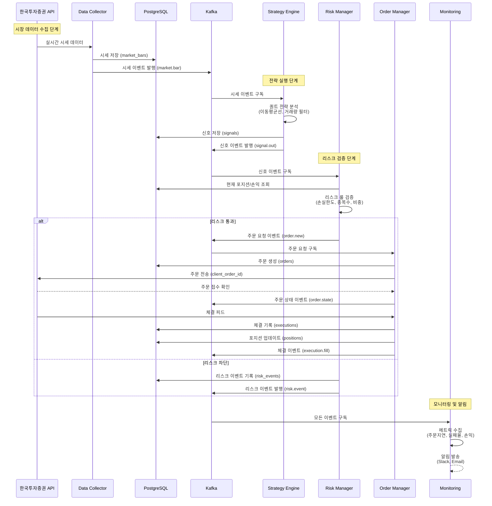
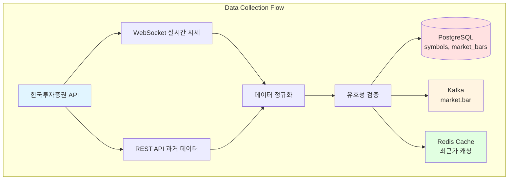
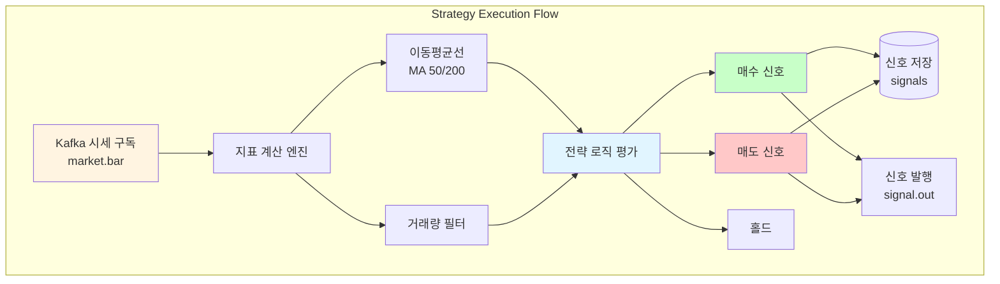
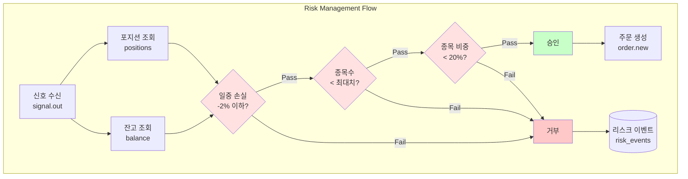
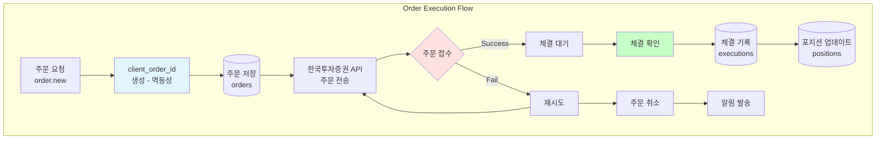

# 개인용 주식 자동 매매 시스템

개인 투자자를 위한 데이터 기반 퀀트 자동 매매 시스템 - 한국투자증권 OpenAPI 연동

## 📋 목차
- [시스템 개요](#-시스템-개요)
- [시스템 FLOW](#-시스템-flow)
- [주요 작업 내용](#-주요-작업-내용)
- [핵심 기능](#-핵심-기능)
- [기술 스택](#-기술-스택)
- [설치 및 실행](#-설치-및-실행)

## 🎯 시스템 개요

### 비전
개인 투자자가 반복적이고 감정적인 매매를 줄이고, **데이터 기반 의사결정**을 자동화합니다. 한국투자증권 API를 시작점으로, 추후 다른 브로커 API로 확장할 수 있는 **모듈형 구조**를 설계합니다.

### 핵심 목표
- **자동화**: 특정 조건 충족 시 주문 자동 실행
- **데이터 관리**: 시세/체결 데이터 수집 및 로컬 저장
- **리스크 관리**: 손실 제한, 보유 종목 제한
- **모듈성**: API 인터페이스 추상화로 교체 용이
- **관측성**: 로그와 지표로 투명한 추적

## 🔄 시스템 FLOW

### 전체 거래 흐름



### 1. 데이터 수집 흐름



**단계별 상세:**

1. **API 연결**: 한국투자증권 OpenAPI 인증 (API Key/Secret → Access Token)
2. **실시간 시세**: WebSocket을 통한 실시간 호가/체결 데이터 수집
3. **과거 데이터**: REST API를 통한 과거 봉 데이터 수집
4. **정규화**: OHLCV(시가/고가/저가/종가/거래량) 표준 포맷 변환
5. **저장**: PostgreSQL에 시계열 데이터 저장, Kafka로 이벤트 스트림 발행

### 2. 전략 실행 흐름



**전략 예시 (이동평균선 + 거래량):**

```python
# 의사 코드
if MA_50 > MA_200 and volume > avg_volume * 1.5:
    signal = "BUY"
elif MA_50 < MA_200:
    signal = "SELL"
else:
    signal = "HOLD"
```

### 3. 리스크 관리 흐름



**리스크 룰:**

1. **일중 손실 한도**: -2% 이상 손실 시 거래 중지
2. **종목 수 제한**: 최대 보유 종목 수 제한
3. **종목 비중 제한**: 단일 종목 포트폴리오 내 20% 이하
4. **쿨다운**: 동일 종목 연속 주문 실패 시 일정 시간 대기

### 4. 주문 실행 흐름



**주문 상태 추적:**

- `PENDING`: 주문 생성
- `SUBMITTED`: API 전송 완료
- `ACCEPTED`: 거래소 접수
- `PARTIALLY_FILLED`: 부분 체결
- `FILLED`: 전체 체결
- `CANCELLED`: 주문 취소
- `REJECTED`: 주문 거부
- `FAILED`: 주문 실패

## 🛠 주요 작업 내용

### 1. 브로커 API 추상화 계층 (BrokerAdapter)

**담당 작업:**
- 브로커 인터페이스 정의 및 구현
- 한국투자증권 OpenAPI Adapter 구현
- API 인증 및 토큰 관리
- 주문/시세/잔고/포지션 API 통합

**주요 구현 내용:**

```python
# BrokerAdapter 인터페이스
class BrokerAdapter(ABC):
    @abstractmethod
    async def get_price(self, symbol: str) -> Price:
        """현재가 조회"""
        pass

    @abstractmethod
    async def send_order(
        self,
        symbol: str,
        side: OrderSide,
        qty: int,
        price: Optional[float],
        order_type: OrderType
    ) -> Order:
        """주문 전송"""
        pass

    @abstractmethod
    async def get_balance(self) -> Balance:
        """잔고 조회"""
        pass

    @abstractmethod
    async def get_positions(self) -> List[Position]:
        """보유 포지션 조회"""
        pass
```

**구현 상세:**
- 인증 토큰 자동 갱신 (만료 처리)
- API Rate Limit 관리
- 오류 코드별 재시도 전략
- 모의투자/실거래 환경 분리

### 2. 데이터 수집 시스템 (Data Collector)

**담당 작업:**
- 실시간 시세 WebSocket 연결 관리
- 과거 데이터 REST API 수집
- 관심 종목 리스트 관리
- 데이터 정규화 및 저장

**주요 구현 내용:**

**PostgreSQL 스키마:**
```sql
-- 종목 메타 정보
CREATE TABLE symbols (
    symbol_id SERIAL PRIMARY KEY,
    symbol VARCHAR(20) UNIQUE NOT NULL,
    name VARCHAR(100),
    market VARCHAR(20),
    status VARCHAR(20),
    created_at TIMESTAMP DEFAULT NOW()
);

-- 시세 데이터 (파티션: 날짜별)
CREATE TABLE market_bars (
    bar_id BIGSERIAL PRIMARY KEY,
    ts TIMESTAMP NOT NULL,
    symbol VARCHAR(20) NOT NULL,
    open NUMERIC(12, 2),
    high NUMERIC(12, 2),
    low NUMERIC(12, 2),
    close NUMERIC(12, 2),
    volume BIGINT,
    source VARCHAR(50),
    created_at TIMESTAMP DEFAULT NOW()
) PARTITION BY RANGE (ts);

CREATE INDEX idx_market_bars_symbol_ts ON market_bars (symbol, ts DESC);
```

**Kafka 토픽:**
- `market.bar`: 시세 데이터 스트림 (파티션 키: symbol)

**구현 특징:**
- WebSocket 재연결 로직 (지수 백오프)
- 데이터 유효성 검증 (가격 범위, 거래량 이상치)
- PostgreSQL 파티셔닝으로 성능 최적화
- Redis 캐싱으로 최근가 빠른 조회

### 3. 전략 실행 엔진 (Strategy Engine)

**담당 작업:**
- 기술적 지표 계산
- 전략 로직 실행
- 매매 신호 생성
- 백테스팅 시스템

**주요 구현 내용:**

**지표 계산:**
```python
# 이동평균선 계산
def calculate_moving_average(prices: List[float], period: int) -> float:
    return sum(prices[-period:]) / period

# 거래량 필터
def volume_filter(current_volume: int, avg_volume: int, threshold: float = 1.5) -> bool:
    return current_volume > avg_volume * threshold
```

**전략 플러그인 구조:**
```python
class Strategy(ABC):
    def __init__(self, params: StrategyParams):
        self.params = params

    @abstractmethod
    async def analyze(self, market_data: MarketData) -> Signal:
        """시장 데이터 분석 후 신호 생성"""
        pass

    @abstractmethod
    def get_params_hash(self) -> str:
        """파라미터 해시 (버전 관리)"""
        pass
```

**PostgreSQL 스키마:**
```sql
-- 신호 저장
CREATE TABLE signals (
    signal_id BIGSERIAL PRIMARY KEY,
    ts TIMESTAMP NOT NULL,
    strategy_id VARCHAR(50) NOT NULL,
    symbol VARCHAR(20) NOT NULL,
    direction VARCHAR(10) NOT NULL, -- BUY, SELL, HOLD
    strength NUMERIC(3, 2), -- 0.0 ~ 1.0
    params_hash VARCHAR(64),
    reason JSONB, -- 신호 생성 근거
    created_at TIMESTAMP DEFAULT NOW()
);

CREATE INDEX idx_signals_symbol_ts ON signals (symbol, ts DESC);
```

**전략 파라미터 외부화 (YAML):**
```yaml
strategies:
  - name: "moving_average_cross"
    params:
      ma_short: 50
      ma_long: 200
      volume_threshold: 1.5
      stop_loss: -0.05  # -5%
      take_profit: 0.10  # +10%
```

### 4. 리스크 관리 시스템 (Risk Manager)

**담당 작업:**
- 실시간 리스크 메트릭 계산
- 사전/사후 리스크 룰 검증
- 손실 한도 모니터링
- 긴급 정지 (Kill Switch)

**주요 구현 내용:**

**리스크 룰:**
```python
class RiskRule(ABC):
    @abstractmethod
    async def check(self, context: RiskContext) -> RiskDecision:
        """리스크 검증"""
        pass

class DailyLossLimitRule(RiskRule):
    def __init__(self, limit_pct: float = -0.02):
        self.limit_pct = limit_pct

    async def check(self, context: RiskContext) -> RiskDecision:
        daily_pnl = context.get_daily_pnl()
        if daily_pnl < self.limit_pct:
            return RiskDecision(
                approved=False,
                reason=f"일중 손실 한도 초과: {daily_pnl:.2%}"
            )
        return RiskDecision(approved=True)
```

**PostgreSQL 스키마:**
```sql
-- 리스크 이벤트 기록
CREATE TABLE risk_events (
    event_id BIGSERIAL PRIMARY KEY,
    ts TIMESTAMP NOT NULL,
    rule_id VARCHAR(50) NOT NULL,
    symbol VARCHAR(20),
    input_snapshot JSONB, -- 검증 시점 입력
    decision VARCHAR(20) NOT NULL, -- APPROVED, REJECTED
    message TEXT,
    created_at TIMESTAMP DEFAULT NOW()
);
```

**Kill Switch 구현:**
```python
class KillSwitch:
    def __init__(self):
        self._active = False

    def activate(self, reason: str):
        """긴급 정지 활성화"""
        self._active = True
        # 1. 신규 주문 차단
        # 2. 미체결 주문 취소
        # 3. 알림 발송
        logger.critical(f"Kill Switch 활성화: {reason}")

    def is_active(self) -> bool:
        return self._active
```

### 5. 주문 관리 시스템 (Order Manager)

**담당 작업:**
- 주문 생성 및 전송
- 체결 확인 및 상태 추적
- 부분 체결 처리
- 주문 실패 재시도

**주요 구현 내용:**

**PostgreSQL 스키마:**
```sql
-- 주문
CREATE TABLE orders (
    order_id BIGSERIAL PRIMARY KEY,
    client_order_id VARCHAR(100) UNIQUE NOT NULL, -- 멱등키
    symbol VARCHAR(20) NOT NULL,
    side VARCHAR(10) NOT NULL, -- BUY, SELL
    qty INT NOT NULL,
    price NUMERIC(12, 2),
    order_type VARCHAR(20) NOT NULL, -- MARKET, LIMIT
    status VARCHAR(20) NOT NULL,
    error_code VARCHAR(50),
    submitted_at TIMESTAMP,
    accepted_at TIMESTAMP,
    filled_at TIMESTAMP,
    created_at TIMESTAMP DEFAULT NOW()
);

-- 체결
CREATE TABLE executions (
    exec_id BIGSERIAL PRIMARY KEY,
    order_id BIGINT REFERENCES orders(order_id),
    exec_price NUMERIC(12, 2) NOT NULL,
    exec_qty INT NOT NULL,
    fee NUMERIC(12, 2),
    tax NUMERIC(12, 2),
    cumulative_qty INT,
    exec_at TIMESTAMP NOT NULL,
    created_at TIMESTAMP DEFAULT NOW()
);

-- 포지션
CREATE TABLE positions (
    position_id SERIAL PRIMARY KEY,
    symbol VARCHAR(20) UNIQUE NOT NULL,
    qty INT NOT NULL,
    avg_price NUMERIC(12, 2) NOT NULL,
    realized_pnl NUMERIC(12, 2) DEFAULT 0,
    unrealized_pnl NUMERIC(12, 2) DEFAULT 0,
    updated_at TIMESTAMP DEFAULT NOW()
);
```

**멱등성 보장 (client_order_id):**
```python
def generate_client_order_id(symbol: str, side: str) -> str:
    """고유 주문 ID 생성"""
    timestamp = int(time.time() * 1000)
    random_suffix = secrets.token_hex(4)
    return f"{symbol}_{side}_{timestamp}_{random_suffix}"
```

**Kafka 토픽:**
- `order.new`: 주문 생성 이벤트
- `order.state`: 주문 상태 변경 이벤트
- `execution.fill`: 체결 이벤트

### 6. 모니터링 및 관측성 (Monitoring & Observability)

**담당 작업:**
- 구조화 로깅 시스템
- 메트릭 수집 및 대시보드
- 알림 시스템
- 거래 감사 추적

**주요 구현 내용:**

**구조화 로깅 (JSON):**
```python
import structlog

logger = structlog.get_logger()

# 주문 로그 예시
logger.info(
    "order_submitted",
    correlation_id=correlation_id,
    client_order_id=client_order_id,
    symbol=symbol,
    side=side,
    qty=qty,
    price=price,
    reason="MA50 > MA200, volume spike"
)
```

**메트릭 수집:**
- 주문 지연 (latency)
- 주문 실패율
- 체결 비율
- 슬리피지 추정
- 현재/최대 드로우다운
- 일간/주간/월간 수익률

**알림 채널:**
- Slack: 실시간 거래 알림, 리스크 경고
- Email: 일일 리포트, 긴급 알림

**PostgreSQL 스키마:**
```sql
-- 설정 버전 관리
CREATE TABLE configs (
    config_id SERIAL PRIMARY KEY,
    config_type VARCHAR(50) NOT NULL, -- STRATEGY, RISK, BROKER
    config_name VARCHAR(100) NOT NULL,
    config_data JSONB NOT NULL,
    version INT NOT NULL,
    applied_at TIMESTAMP DEFAULT NOW(),
    applied_by VARCHAR(100)
);
```

## 🚀 핵심 기능

### 1. 브로커 API 추상화
- BrokerAdapter 인터페이스 정의
- 한국투자증권 OpenAPI 구현체
- 추후 다른 브로커 Adapter 추가 가능
- 모의투자/실거래 환경 분리

### 2. 데이터 수집
- 실시간 WebSocket 시세 수집
- REST API 과거 데이터 수집
- PostgreSQL 시계열 저장 (파티셔닝)
- Kafka 이벤트 스트림 발행
- Redis 캐싱

### 3. 퀀트 전략 실행
- 이동평균선 50일/200일 교차
- 거래량 필터
- 손절 -5%, 목표 수익 +10%
- 전략 플러그인 구조 (파라미터 외부화)

### 4. 리스크 제어
- 일중 손실 한도: -2% 이상 시 거래 중지
- 종목당 최대 보유 수량 제한
- 포트폴리오 내 종목 비중 제한 (20%)
- 쿨다운: 동일 종목 연속 주문 실패 시 대기
- Kill Switch: 긴급 정지

### 5. 주문 관리
- client_order_id 멱등키 (중복 방지)
- 주문 상태 추적 (실시간)
- 부분 체결 처리
- 실패 시 재시도/취소/알림

### 6. 관측성
- 구조화 로그 (JSON + correlation_id)
- 메트릭: 주문 지연, 실패율, 드로우다운, 체결 비율
- 알림: Slack, Email
- 일간 리포트 생성

## 💻 기술 스택

### Runtime & Language
- **Python**: 3.12+ (LTS)
- **패키지 관리**: uv 또는 poetry (잠금파일 필수)
- **타입/품질**: mypy, ruff, black, bandit

### 데이터 저장소
- **PostgreSQL**: 14+ (시계열 데이터, 파티셔닝)
- **Redis**: 7+ (캐싱, 최근가)

### 스트리밍
- **Kafka**: 이벤트 스트림 (at-least-once, 멱등 프로듀서)
- **스키마**: Avro 또는 Protobuf

### 동시성
- **asyncio**: 이벤트 루프 기반 I/O 바인딩

### 인프라
- **Docker**: 슬림 베이스 + distroless 런타임
- **Docker Compose**: 개발/테스트/실거래 환경 분리

### 구성 관리
- **pydantic-settings**: YAML/ENV 파일 로드

### 모니터링
- **구조화 로깅**: structlog
- **메트릭**: Prometheus (선택사항)
- **알림**: Slack, Email

## 📊 데이터 모델

### 핵심 테이블
- `symbols`: 종목 메타
- `market_bars`: 시세 (파티션: 날짜)
- `signals`: 전략 신호
- `orders`: 주문
- `executions`: 체결
- `positions`: 포지션
- `risk_events`: 리스크 이벤트
- `configs`: 설정 버전 관리

### Kafka 토픽
- `market.bar`: 시세 데이터
- `signal.out`: 전략 신호
- `order.new`: 주문 생성
- `order.state`: 주문 상태 변경
- `execution.fill`: 체결
- `risk.event`: 리스크 이벤트

## 🛠 설치 및 실행

### 1. 환경 요구사항

- Python 3.12+
- PostgreSQL 14+
- Redis 7+
- Kafka (선택사항, 개발 환경에서는 로컬 큐 사용 가능)
- Docker & Docker Compose (권장)

### 2. 저장소 클론

```bash
git clone https://github.com/smk692/auto-trading-system.git
cd auto-trading-system
```

### 3. 의존성 설치

```bash
# uv 사용 (권장)
uv sync

# 또는 poetry 사용
poetry install
```

### 4. 환경 변수 설정

`.env.example` 파일을 복사하여 `.env` 파일을 생성:

```bash
cp .env.example .env
```

#### 필수 환경 변수

```bash
# 한국투자증권 API
KIS_APP_KEY=your_app_key
KIS_APP_SECRET=your_app_secret
KIS_ACCOUNT_NO=your_account_number
KIS_ACCOUNT_TYPE=01  # 01: 모의투자, 실거래는 별도 설정

# PostgreSQL
DB_HOST=localhost
DB_PORT=5432
DB_NAME=trading_db
DB_USER=trading_user
DB_PASSWORD=your_db_password

# Redis
REDIS_HOST=localhost
REDIS_PORT=6379

# Kafka (선택사항)
KAFKA_BOOTSTRAP_SERVERS=localhost:9092

# 리스크 관리
MAX_DAILY_LOSS_PCT=-0.02  # -2%
MAX_POSITION_COUNT=5
MAX_POSITION_WEIGHT_PCT=0.20  # 20%

# 알림
SLACK_WEBHOOK_URL=your_slack_webhook_url
SMTP_HOST=smtp.gmail.com
SMTP_PORT=587
SMTP_USER=your_email@gmail.com
SMTP_PASSWORD=your_email_password
```

### 5. 데이터베이스 마이그레이션

```bash
# PostgreSQL 스키마 생성
python scripts/migrate_db.py
```

### 6. 실행

#### 개발 모드 (페이퍼 트레이딩)
```bash
python main.py --env dev --paper-trading
```

#### 프로덕션 모드 (실거래)
```bash
python main.py --env prod
```

#### Docker로 실행
```bash
docker-compose up -d
```

## 📋 시스템 체크리스트

배포 전 확인 사항:

- [ ] PostgreSQL/Redis 내부 IP, 방화벽 설정 완료
- [ ] 한국투자증권 API 키 발급 + 모의 계정 테스트 통과
- [ ] 전략 플러그인 파라미터 확정 (이평+거래량)
- [ ] 레이트 제한/쿨다운/가격 콜라 기준값 설정
- [ ] Kill Switch 동작 리허설 (페이퍼/실전 분리)
- [ ] 백테스트 ↔ 페이퍼 결과 차이 리포트 생성

## ⚠️ 주의사항

1. **투자 리스크**: 자동 매매 시스템은 투자 손실 위험이 있습니다.
2. **페이퍼 트레이딩 필수**: 실제 자금 투입 전 충분한 모의투자 테스트를 진행하세요.
3. **API 키 보안**: API 키는 절대 공개 저장소에 커밋하지 마세요 (`.env` 사용).
4. **리스크 관리**: 손실 한도를 반드시 설정하고 지키세요.
5. **법적 책임**: 모든 거래 결과에 대한 책임은 사용자에게 있습니다.

## 📚 단계적 로드맵

- **v0**: 데이터 수집 + 신호 출력
- **v1**: 한국투자증권 API 주문 연동 + 체결 확인
- **v1.1**: 리스크 제어, 리포트, 알림 추가
- **v2**: 전략 플러그인 구조 + UI 대시보드 확장
- **v3**: 다중 브로커 Adapter 지원 + 고급 전략

## 📝 라이선스

MIT License

## ⚖️ 면책 조항

이 소프트웨어는 교육 및 연구 목적으로 제공됩니다. 실제 거래에 사용할 경우 발생하는 모든 손실에 대해 개발자는 책임을 지지 않습니다. 투자는 본인의 판단과 책임 하에 진행하시기 바랍니다.
